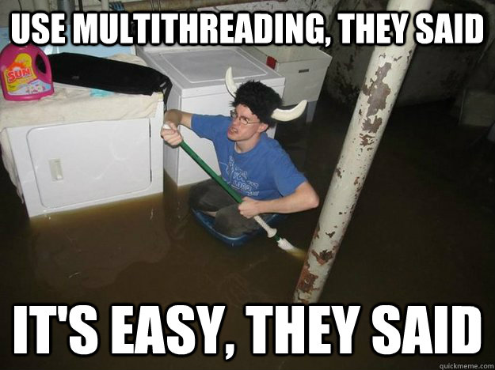

class: center, middle

# An overview of Rust 1.0


.right[*By Adolfo Ochagavía*]

---

class: middle, center

## Why another programming language?

---

class: middle

.fit100[]

???

Domain:
* Systems where speed and realiability are very important: Operating System, Web Browser, ...

Problem:
* For performance and control reasons, software in this domain is usually written in C or C++
* Manual memory management causes bugs and vulnerabilities
* Conventional languages don't protect you from data races
* Safer languages are a no-go... Too little control!

---

class: center, middle

This is what we want to prevent...


And this...


???

In words of Bjarne Stroustrup: *C makes it easy to shoot yourself in the foot; C++ makes it harder, but when you do it blows your whole leg off*

---

# The Challenge

Combine:
* Low-level power
* High-level expressiveness
* Memory and thread safety

???

* Low-level power: memory layout, pointers, allocators, static/dynamic dispatch, etc
* High-level expressiveness: see slide about features
* Memory safety: no segfaults, no dangling pointers, no double freeing, etc
* Thread unsafety: two unsynchronized threads accessing the same data where at least one of them writes

---

# In other words...

#### Rethinking C with the knowledge we have gathered in the latest years of research...

#### So it becomes harder to shoot yourself in the foot...

#### And it remains easy to do low level stuff.

---

# Rust to the rescue

*Rust is a systems programming language that runs blazingly fast, prevents nearly all segfaults, and guarantees thread safety*.

#### Core features:

* Guaranteed memory safety **without garbage collection**
* Guaranteed thread safety (no data races)
* Minimal runtime (speed!)
* Close to the metal

#### Useful goodies:

* Pattern matching
* Strongly typed + type inference
* Closures and higher order functions
* Trait-based generics (a la haskell)
* Opt-in mutability

???

* Low level power mentioned in the previous slide is allowed in Rust

---

# Hello world

```rust
fn main() {
    println!("Hello world");
}
```

#### Hello world alternative

```rust
fn main() {
    let name = "Riza";
    println!("Hello {}", name);
}
```

???

* Run this on the playpen
* Show what happens when the placeholders don't match with the amount of variables at the right side

---

# Topics

1. Real world example
1. Immutability
1. Ownership, benefits and caveats
1. Structs, enums and traits
1. Generics
1. Projects using Rust
1. Conclusions
1. Questions

---

# Real world example

The following code has a data race. Can you spot it?

```rust
fn main() {
    let mut server = Nickel::new(); // Nickel is a web framework
    let mut visitors = 0;

    // Register a route
    // The second argument is a closure
    // The visitor count will be increased each time a GET is received
    server.get("/", |request, response| {
        // Increase visitor count
        visitors += 1;
    });

    server.listen("127.0.0.1:3000");
}
```

???

* Taken from a stack overflow question and simplified (why does it not compile!?)
* Most programming languages offer no solution for this...
* This would compile perfectly on Java
* Functional solution: make everything immutable
* Rust solution: use the type system to ensure that mutations require synchronization!
* Note how types are deduced and you don't have to write them! variables and closure

---

class: center, middle



---

class: center

# Immutability

.fit[]

---

### Default immutability, opt-in mutability

Example:

```rust
fn main() {
    let x = 5;
    x += 10; // Error: re-assignment of immutable variable 'x'
}
```

Correct version:

```rust
fn main() {
    let mut x = 5;
    x += 10; // Works!
}
```

Another example:

```rust
fn main() {
    let mut xs = vec![1, 2, 3, 4]; // A list of numbers
    xs.push(5); // Add a number to the list
    xs[0] += 10;
}
```

???

* Note that (im)mutability is deep. It is more than assignment immutability (like in C#)
* In other words, you cannot mutate the contents of an immutable container

---

class: center, middle

# Ownership


???

* Secret sauce that allows memory safety and forbids data races (magical rules)
* First: how does ownership work
* Second: benefits and caveats
* I will begin with a simple ownership model and expand it in each slide

---

# Ownership: moves

* Every object has an owner (i.e. it is owned by a variable)
* Only the owner has access to the object (true for now...)
* If the owner goes out of scope, the object is deleted from memory
* Ownership can be transferred (this is called a **move** in Rust jargon)

Example 1:

```rust
fn main() {
    let numbers = vec![1, 2, 3, 4];
    let new_owner = numbers; // Works: 'numbers' has been moved to 'new_owner'
    let wrong = numbers; // Error: use of moved value: 'numbers'
}
```

Example 2:


```rust
fn main() {
    let numbers = vec![1, 2, 3, 4];
    do_something(numbers); // Works: 'numbers' has been moved to 'do_something'
    do_something(numbers); // Error: use of moved value: 'numbers'
}

// The type of the parameter indicates that the object is moved
fn do_something(xs: Vec<i32>) { }
```

???

* They seem to be useless rules... But! They allow memory safety!
* Make sure everybody understands that the memory is freed when the owner falls out of scope

---

# Ownership: copying

* Some objects are **copied** by default (so they are never **moved**)
* Examples of such types: number primitives, characters, etc
* When you define a new type, you can specify whether it should be **copied** automatically or **moved**.

```rust
fn main() {
    let number = 42;
    let copy_1 = number;
    let copy_2 = number; // This works: 'number' has not been moved, only copied
}
```

```rust
fn main() {
    let number = 42;
    do_something(number);
    do_something(number); // This works: 'number' has not been moved, only copied
}

fn do_something(x: i32) { }
```

???

* Copy types: types that are cheap to copy

---

# Ownership: borrowing

* Sometimes it is useful to *borrow* the object and give it back later
* The owner *lends* the object, without transferring ownership
* You can think of **&** as the borrow operator
* It is a *read-only* reference

Example:

```rust
fn main() {
    let numbers = vec![1, 2, 3, 4];
    print_numbers(&numbers); // Borrowing allows to keep ownership!
    print_numbers(&numbers);
}

// Print a list of numbers, each one in one line
// NOTE: the type of the parameter is &Vec<i32> and NOT Vec<i32>
fn print_numbers(numbers: &Vec<i32>) {
    for n in numbers {
        println!("{}", n);
    }
    
    // This is forbidden (numbers is read-only)
    // numbers[0] += 5;
}
```

???

Play a little bit in the playpen to show:
* The code snippet would not compile if `print_numbers` took by value
* The owner cannot mutate an object while it is borrowed
* The compiler forbids that the owner is deleted while a borrow is active (if it is asked)

---

# Ownership: borrowing

* You can also create a *read-write* reference (mutable borrow)
* A mutable borrow is always unique (it cannot coexist with other borrows)

Example:

```rust
fn main() {
    let mut numbers = vec![1, 2, 3, 4];
    add_1(&mut numbers); // Still works!
    add_1(&mut numbers);
}

// Adds one to each number in the list
// NOTE: the type of the parameter is &mut Vec<i32> and NOT &Vec<i32> or Vec<i32>
fn add_1(numbers: &mut Vec<i32>) {
    for n in numbers {
        *n += 1;
    }
}
```

???

* Rust will not let you mutate an object while there are other references to it (you can skip this rule in single-thread mode)

---

# Ownership: lifetimes

The following code won't compile... Can you see why?

```rust
// Return a reference to a number in numbers
fn get_number() -> &i32 {
    let numbers = vec![1, 2, 3, 4];
    return &numbers[0];
}
```

???

* Rust ensures that all references point to existing objects (no dangling pointers)
* Here it is pretty easy... There are some complex scenarios! Rustc itself

---

class: center, middle


---

# Ownership: summary

* Every object has an owner
* Objects are deleted when the owner gets out of scope
* The owner can lend the object
* The object can be mutated by the owner and by a read-write borrower
* The object can be read by the owner and any kind of borrower

???

* When I say object I mean anything that can be put into a variable

---

# Ownership: benefits

### No GC

Objects are destroyed when they fall out of scope.

### Thread Safety

No mutable aliasing across threads.

???

* Thread safety: you cannot have multiple unique borrows to the same object across threads, so you cannot mutate the same object... You are forced by the type system to use a locking mechanism.
* Aliasing: multiple variables pointing to the same object

---

# Ownership: caveats

* Sometimes there is no clear owner
* In such cases it can be very verbose to work around it

???

* Doubly linked list example of no clear owner
* Rust can get in your way (verbose code). A GC gives you normal code, but less performance. Trade off
* Reference counting to the rescue
* No problems with my programs: sudoku solver, calculator, mine sweeper, hangman, and other stuff

---

# Structs

```rust
// Define the data structure
struct Person {
    age: u8,
    name: String
}

// Define the methods
impl Person {
    fn say_hi(&self) {
        println!("{} says hi", self.name);
    }
    
    // Other useless methods omitted
}

fn main() {
    let person = Person { age: 38, name: "Gijs".to_string() };
    person.say_hi();
}
```

---

# Enums

```rust
// Define the data structure
enum Shape {
    Square(i32),
    Rectangle(i32, i32)
}

// Define the methods
impl Shape {
    fn surface(&self) -> i32 {
        match *self {
            Shape::Square(x) => x * x,
            Shape::Rectangle(x, y) => x * y
        }
    }
}

fn main() {
    let square = Shape::Square(5);
    let rectangle = Shape::Rectangle(2, 8);
    println!("Shape surface: {}, rectangle surface: {}",
        square.surface(), rectangle.surface());
}
```

---

# Traits

```rust
// Define the interface
trait Show { fn show(&self) -> String; }

// Implement it for Person
impl Show for Person {
    fn show(&self) -> String {
        return format!("A {} years old person called {}", self.age, self.name);
    }
}

// Implement it for Shape
impl Show for Shape {
    fn show(&self) -> String {
        match *self {
            Shape::Square(x) => return format!("A square of side {}", x),
            Shape::Rectangle(x, y) =>
                return format!("A rectangle of sides {} and {}", x, y)
        }
    }
}

fn main() {
    let person = Person { age: 42, name: "Gijs".to_string() };
    let (square, rectangle) = (Shape::Square(5), Shape::Rectangle(2, 8));
    println!("{}, {}, {}", person.show(), square.show(), rectangle.show());
}
```

---

# Generics

```rust
// The parameter of this function can be of any type,
// provided that it 'implements' the 'Show' trait
fn print<T: Show>(thing: &T) {
    println!("{}", thing.show());
}

// This function will sort a list of elements,
// provided that the elements can be compared to each other
fn sort<T: Ord>(list: &mut Vec<T>) { /* ... */ }
```

???

* Monomorphization (resolved at compile time)
* Alternative: receive a pointer to an object that implements the trait. Requires a v-table
* Builtin traits: display, ord, clone
* Ord can be used for sorting

---

# Projects using Rust

* Servo
* Skylight
* OpenDNS
* The Hyve?

???

* Servo: a highly parallel web browser engine written in Rust
* OpenDNS (a DNS offering phishing protection and content filtering) is using Rust to populate the DNS database
* Skylight (a profiler for Rails apps) is written in Rust and exposed as a Ruby gem
* The Hyve: ETL (extract, transform, load), Analysis (modules in Rust for R)

---

# Conclusions

*Node.js gave front-end programmers the power of writing back-end code. Rust gives normal programmers the power of safely writing low-level code.*

So:
* The next time you need to program something in C, do it in Rust!
* The next time you have speed problems in programming language X, write a module for it in Rust!

---

class: center

.fit[]

---

# There's more to it...
* [Aaron Turon's talk in Stanford](https://www.youtube.com/watch?v=O5vzLKg7y-k)
* [Introduction to Rust](http://doc.rust-lang.org/stable/book/)
* [Rust Ownership The Hard Way](http://chrismorgan.info/blog/rust-ownership-the-hard-way.html)
* [Fearless Concurrency](http://blog.rust-lang.org/2015/04/10/Fearless-Concurrency.html)
* \#rust on irc.mozilla.org

???

Searching on google works pretty bad, since there have been many breaking changes before 1.0. Use my list and the IRC channel!