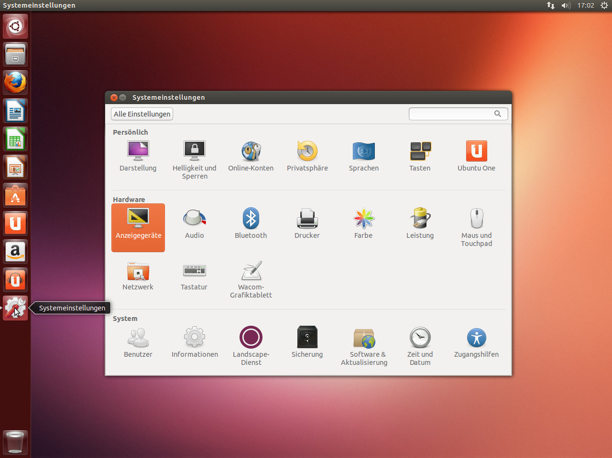
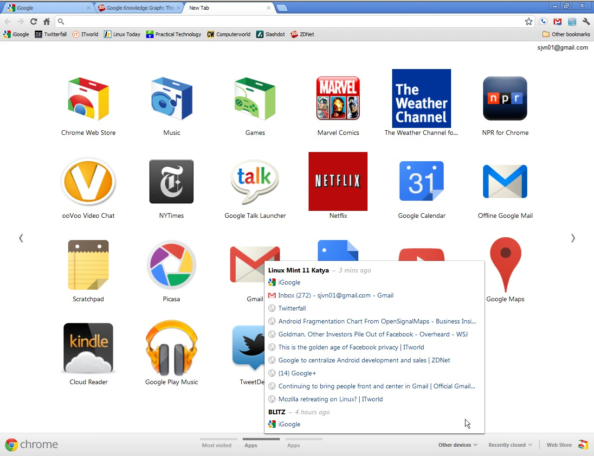
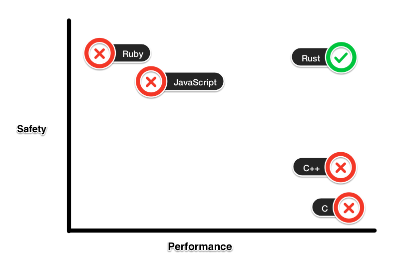
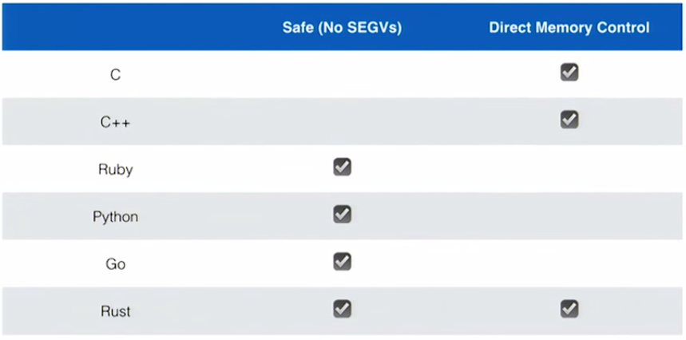

class: center, middle

# A lightning overview of Rust


.right[*By Adolfo Ochagavía*]

---

class: center, middle

### Why does Rust exist?
### What is Rust actually?
### Why should you care?

???

*15 minutes is not that much... Code example at the end if there is enough time. Feel free to talk to me afterwards during the borrel.*

---

class: center, middle

# Why does Rust exist?

???

If you want to create a programming language and you want it to be used by a lot of people, you better have a good reason for it!

It would only make sense if it introduces features that are currently lacking

---

class: center, middle

# A specific domain

speed and low-level control

???

Domain of programs

Use cases where you need high control and speed:
* Games (C++)
* Operating Systems (C)
* Browser engines (C++)

---

.fit100[]

---

.fit100[]

---

.fit100[]

???

* JavaScript Engine (C++)
* Libraries (C and C++) -- OpenSSL, OpenCV...
* DNS Software (C and C++) -- reference to PowerDNS and Pieter Lexis

---

class: center, middle

# Problems of C and C++

outdated technology?

???

* C and C++ let you do a lot of crazy stuff, which is great... unless you do them per accident.
* The compiler will not protect you!
* You need to know really a lot before you are confident about the correctness of your programs.

Concrete consequences: bugs and vulnerabilities (browsers, OpenSSL, operating systems...)

In words of Bjarne Stroustrup: *C makes it easy to shoot yourself in the foot; C++ makes it harder, but when you do it blows your whole leg off*

---

class: center

# What Rust aims at

.fit100[]

---

class: center

# In other words...

.fit100[]

---

class: center, middle

.fit100[]

???

The Holy Grail of low-level programming!

The sweet spot!

* No bugs related to memory management (segfaults)
* No data races in multithreaded code
* While having the same power as C and C++

---

# What is Rust actually?

#### *"a systems programming language that runs blazingly fast, prevents nearly all segfaults, and guarantees thread safety"* ([rust-lang.org](www.rust-lang.org))

???

# This means:

* Guaranteed memory safety **without garbage collection**
* Guaranteed thread safety (no data races): if you can mutate a variable, then you have the guarantee that no other thread will write/read it at the same time
* Minimal runtime (c-like speed!)

# In other words...

* Rethinking C with the knowledge we have gathered in the latest years of research...
* So it becomes harder to shoot yourself in the foot...
* And it remains easy to do low level stuff.

---

class: center, middle

# How?

(Ownership)

???

Introduce a new concept called ownership.

Ownership:
* Extra rules
* Enforced by the compiler
* Allow the compiler to guarantee memory and thread safety
* If you dive into Rust, this will be the main thing you will need to understand

* Not enough time to cover it now...

---

class: center, middle

# Why should you care?

???

People with no experience in low level programming are able to program in Rust while being confident that their code is correct!

Normal programmers can write low level code! -> New power!

What does this mean for a normal programmer who just doesn't care about memory and performance?

* It may happen that you have a bottleneck in your application and would love to speed it up...
* You could write a library in C but it is just too dangerous, because you are (probably) not a C expert...
* You can write it in Rust and compile it as a C library!

* If you have a huge system, you could rewrite parts of it in Rust, expose them as C modules and use them! Parts of Firefox

But of course, you can go even further and rewrite everything in Rust! You will be surprised to realise that many common programming tasks don't require garbage collection!

---

class: center, middle

# Case study: Skylight

(see [Skylight's blog](http://blog.skylight.io/our-new-featherweight-agent/))

???

First early adopters... Even before the language was 1.0!

What is Skylight:
* Ruby gem used to monitor Rails apps
* Useful to identify performance bottlenecks or other problems

Their vision:
* Usually profiling is never done in production (it slows down the application)
* People mostly use it while running unit tests in a debug environment, which is less useful
* What if you could write a really fast monitoring program?
* What if you could run it in production?

Situation:
* Current alternatives are written directly in Ruby and have poor performance
* We need a language without garbage collection and with enough control of low-level stuff

First attempt:
* C++ library wrapped in a Ruby gem
* Are you confident enough to let your clients use it?
* Even the brightest C++ hackers have bugs in their code! (think of web browsers)
* What will you tell your clients if their server crashes because of a bug in YOUR code? High risk!

Second attempt:
* Rust library wrapped in a Ruby gem
* Rust offers better safety guarantees

---

class: middle, center

# Summary

???

*Rust gives normal programmers the power of safely writing low-level, highly performant code*

*If performance matters in your domain, you could consider using Rust to speed up your programs and have a benefit over your competition!*

So:
* The next time you need to program something in C or C++, do it in Rust!
* The next time you have speed problems in programming language X, write a library for it in Rust and use it!

---

### Bonus: code example

```rust
fn main() {
    let mut server = Nickel::new(); 
    let mut visitors = 0;

    // Register a route
    // The second argument is a closure
    // The visitor count will be increased
    // each time a GET is received
    server.get("/", |request, response| {
        // Increase visitor count
        visitors += 1;
    });

    server.listen("127.0.0.1:3000");
}
```

???

This doesn't compile...
Several issues, but the biggest one is the data race.
Can anyone spot it?

---

class: center

.fit[]

---

# There's more to it...
* [Introduction to Rust](http://doc.rust-lang.org/stable/book/)
* [Rust Ownership The Hard Way](http://chrismorgan.info/blog/rust-ownership-the-hard-way.html)
* [Fearless Concurrency](http://blog.rust-lang.org/2015/04/10/Fearless-Concurrency.html)
* [Aaron Turon's talk in Stanford](https://www.youtube.com/watch?v=O5vzLKg7y-k)
* [Rust subreddit](http://www.reddit.com/r/rust)
* \#rust on irc.mozilla.org

**Caveat**: Rust may have a steep learning curve depending on your background. Use IRC!
